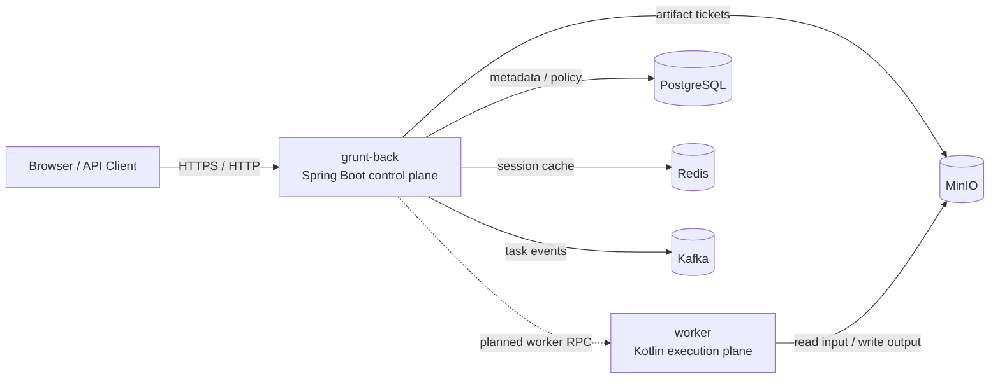

# Container Topology

## Target Topology



## Trust Boundaries

- `grunt-back` is the only public entrypoint and should be the only service that publishes a host port.
- `worker`, `postgres`, `redis`, `kafka`, and `minio` stay on the private `grunteon-platform` network.
- Control-plane artifact downloads are short-lived and one-time; object store paths should never be exposed externally.
- `worker` is treated as an execution-plane container and should not be reachable from the public internet.

## Service Roles

- `grunt-back`
  - Spring Boot control plane
  - owns session/task APIs, policy enforcement, audit surface, and artifact download grants
- `worker`
  - execution-plane runtime
  - currently packaged from `grunt-main-all.jar`
  - runs internal Ktor endpoints today, but is intended to evolve into a narrower worker API
- `postgres`
  - durable metadata store for artifact/task/session state
- `redis`
  - fast session/policy cache and future coordination cache
- `kafka`
  - task event bus between orchestration and execution concerns
- `minio`
  - object storage for input jars, configs, assets, and obfuscated outputs

## Metadata Source Of Truth

- `control_artifact_manifest`
  - source of truth for `objectKey`, storage backend, bucket/path, owner binding, size, and artifact status
- `control_task_state`
  - source of truth for task status, progress/stage, input/config/output object-key relationships, and task-to-session binding
- `control_session_state`
  - source of truth for session status, policy/plane metadata, input/config/output object keys, and library/asset object refs

## Artifact Key Layout

- bucket:
  - `${GRUNT_BACK_MINIO_BUCKET}` in docker profile
- object key rules:
  - upload input jars: `artifacts/input/YYYY/MM/DD/<uuid>/<fileName>`
  - upload configs: `artifacts/config/YYYY/MM/DD/<uuid>/<fileName>`
  - upload assets/libraries: `artifacts/asset/YYYY/MM/DD/<uuid>/<fileName>`
  - task outputs: `artifacts/output/<taskId>/<fileName>`
- `.state/object-store`:
  - local profile: primary file storage
  - docker/minio profile: download cache only
- source of truth split:
  - `MinIO`: file bodies only
  - `Postgres`: artifact metadata, ownership, task state, and session state

## Current Code Alignment

- The compose layout matches the required stack direction: `grunt-back / worker / postgres / redis / kafka / minio`.
- Current code still uses `LocalWorkerGateway` inside `grunt-back`, so the `worker` container is a topology target and packaging baseline rather than a fully remote execution hop today.
- `Temporal` is intentionally not included in this compose file because your requested topology did not list it, and the current code path still uses inline orchestration. The stack reservation remains in `grunt-back` dependencies.

## Port Policy

- Published to host:
  - `grunt-back:8080`
- Internal only:
  - `worker:8081`
  - `postgres:5432`
  - `redis:6379`
  - `kafka:9092`
  - `minio:9000`
  - `minio console:9001`

## Operational Notes

- `minio-init` creates the artifact bucket on startup.
- `kafka-init` creates the required control-plane topics before `grunt-back` starts.
- Kafka image selection is environment-driven via `KAFKA_IMAGE`; the default is `bitnamilegacy/kafka:latest` because the old `bitnami/kafka` tags used by the project are no longer available on Docker Hub.
- `postgres` loads the baseline control-plane schema from `docker/postgres/init`.
- `grunt-back` runs dependency probes on startup; in the docker profile it is expected to fail fast if PostgreSQL, Redis, Kafka, or MinIO are not reachable.
- `worker` mounts dedicated volumes for `logs`, `modules`, and `plugins` so extension jars can be injected without rebuilding the image.
- `grunt-back` mounts `.state` so session state and local object-store fallbacks remain persistent across restarts.
- in MinIO mode, `object-base-dir` is treated as a cache directory for downloaded artifacts rather than the source of truth.
- The current Dockerfiles use `mcr.microsoft.com/openjdk/jdk:21-mariner` and copy prebuilt local jars into the image.
- This keeps compose smoke focused on runtime recovery instead of container-internal Gradle builds and also avoids large build contexts on this host.

## Bring-up

```bash
cp .env.platform.example .env.platform
docker compose --env-file .env.platform -f compose.platform.yml up --build
```

For the current P0 recovery validation flow, run:

```powershell
.\tools\smoke-control-plane-state-docker.ps1
```

The detailed recovery acceptance checklist lives in `docs/docker-recovery-validation.md`.

## Expected Readiness

- `postgres`, `redis`, `kafka`, and `minio` reach healthy state first
- `kafka-init` and `minio-init` exit successfully
- `grunt-back` starts after infrastructure is reachable and logs successful dependency probes
